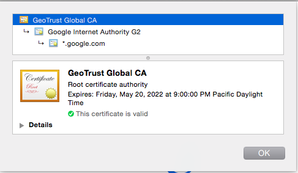
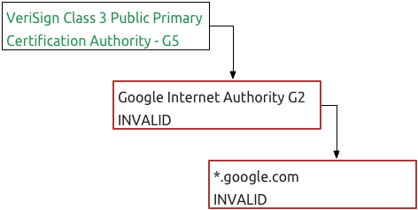
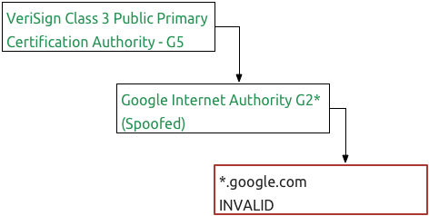
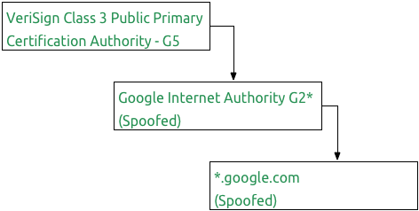

It's only been two weeks since
[news of Lenovo bundling Superfish on their laptops](http://arstechnica.com/security/2015/02/lenovo-pcs-ship-with-man-in-the-middle-adware-that-breaks-https-connections/))
was brought to the public's attention. While the focus has been on who at Lenovo knew about the bundle,
few people are really talking about what it means to the security of the Internet. Developers used to just
enable SSL on their services to check off their security requirements. Developers now need to think
more about security and should pay attention to the new research underway.

## What Is Superfish?

Superfish was basically a program that listened to the HTTP responses heading to the web browser, specifically
the HTML content. Superfish would then add new HTML code to the stream before the web browser received the response
with ads not placed on the site by the site author or would replace existing ads with Superfish ads. The end goal was
to increase the impressions for Superfish ads over traditional ad networks.

__Side Note__: Performing this kind of injection for non-SSL sites doesn't break security, although it's unethical. We
unfortunately live in an internet where the content is supported by ads. Removing the ads from a site and
replacing it with another set basically takes money out of the site's pocket to line Lenovo's pocket.

Since more sites are running SSL, Superfish also contained a "feature" by which it would unwrap the SSL
connection from the site, then reestablish a SSL connection to the browser. In order to prevent the browser
from warning the user that the SSL connection was tampered with, Superfish would generate a SSL cert with
the site's domain and would sign this cert with a Superfish CA certificate. Since the browser trusts all
CA certificates installed locally, the browser would naturally trust this spoofed SSL certificate signed by
Superfish. Now Superfish could read the HTML code and inject ads into pages being transferred via SSL.

## The Problem

The more formal name for the technique used by Superfish is called the
[man-in-the-middle attack](https://www.owasp.org/index.php/Man-in-the-middle_attack).
Instead of just being a clever way to inject ads into pages, Superfish demonstrated on a global level how easy
it is to circumvent the SSL certificate warnings placed into browsers.

Basically, the certificate system is all based on having another intermediate organization use their
certificate to create a certificate for your site. These intermediate organizations have certificates also signed
by other intermediate organizations, building the certificate chain. The certificate chain ends with a certificate
that is trusted implicitly by the browser, known as the root certificate. The only reason these root certificates
are trusted without question is because they are located inside your computer's certificate store.

Let's take a look at an example with google.com. Here's the certificate chain for google.com on March 6th, 2015.

Following the chain, my browser trusts that google.com and all subdomains are trusted because they are also trusted
by Google Internet Authority G2. Likewise, Google Internet Authority G2 can be trusted because it's trusted by
GeoTrust Global CA and the only reason that GeoTrust Global CA is trusted is because it was installed locally as part
of my Mac OS X installation.

__Side Note__: The decision on which certificates get bundled with browsers and operating systems is a
very interesting and very political. Just like network pairing agreements, it's often based  on personal relationships
and boatloads of money being transferred between companies.

So what happens if we swapped out GeoTrust Global CA as the top level certificate and replaced it with
VeriSign Class 3 Public Primary Certification Authority - G5? Well, that would fail because when the browser attempts
to validate Google Internet Authority G2, the certificate signatures wouldn't match.

Now, I could generate a new certificate for Google Internet Authority G2 based off the VeriSign certificate. Now
the top two certificate signatures would match leaving the final certificate, google.com, as the last failing certificate.

When I replace the final google.com certificate, I would then have a certificate chain that's cryptographically valid
and worse yet, the browser has no way to know that all of the certificates have been spoofed.

Notice, none of this required sophisticated knowledge of cryptography or super computing clusters to brute force
attack any algorithms. This type of attack is simple if you have access to the certificate store of the end user's
computer and you can intercept the user's traffic. Both are things you can accomplish fairly easily with a bit
of research from the Internet.

## The Larger Problem

This type of attack isn't just something to worry about locally. Think about the last time you just decided to
connect your iPhone or Android phone to an open wi-fi point. Do you trust that wi-fi provider? Each access point
sits in the middle and assuming they have obtained a certificate authority's private key, they could capture TBs upon
TBs of private data without setting off any alarms or warnings. This type of attack isn't just limited to the NSA
or MI-5 either. There are plenty of known
[security breaches at certificate authorities](https://www.google.com/?gws_rd=ssl#q=certificate+authority+breach) and
probably more we're not aware of.

The largest known recent report came from the Dutch certificate authority
[DigiNotar](http://en.wikipedia.org/wiki/DigiNotar). With the widely
trusted DigiNotar certificates in hand, the attackers then started setting up man-in-the-middle attacks on gmail.com
users. By generating gmail.com certificates on the fly using a different, but valid, certificate chain, user data
was compromised without warning to the user. More disturbing was the fact that Google was unable to revoke the
the phony certificate - in the end they updated Chromium (and Chrome) to blacklist the fraudulent certificates. This
still failed to fix the problem for non-Chromium users and was only possible because they have a browser.

Having SSL is simply not enough anymore.

__Caveat__: While the outlook for SSL is grim right now, you should still pay a reputable certificate authority
for a 1 year certificate and protect all HTTP traffic with SSL. If the entire internet used 1 year certificates,
we limit the exposure to at most a single year.

## Technical Solutions

The good news is that a lot of effort is going into researching how to prevent these type of attacks in the future
and the solution is inspired by the BitCoin block chain. In the August 2014 issue of Communications of the ACM,
an article entitled, "[Certificate Transparency](http://dl.acm.org/citation.cfm?id=2668154)" outlined how researchers
at Google were augmenting the
SSL validation process so the end site being fetched has a role in validating whether or not to trust the certificate
chain that the browser fetched. Using such a technique would prevent such man-in-the-middle attacks used for nefarious
purposes or simply to inject ads by an unethical vendor.

Better still, the [certificate transparency process](http://dl.acm.org/citation.cfm?id=2668154) has been presented
to the internet engineering committee (IETF) and hopefully will become a standard protocol for everyone on the Internet.

## How Can I Help?

We can all do one very important thing to help - __stop buying Lenovo products__. I mentioned that
security on the Internet is currently about trust and Lenovo has shown they can't be trusted. We should assume
that until Lenovo can restore trust that all information passing through the web browser is also being sent to
Lenovo without your consent. For people in the corporate world, this might be a good time to check out a
Macbook.

IT professionals should still continue to use SSL certificates from reputable certificate authorities. While the
protection it offers has problems, we still need to make an attempt to keep user data safe. Beyond that, read up
on the [certificate transparency process](http://www.certificate-transparency.org/) and prepare to upgrade your
servers when the protocol
has been tested and ready for production. If you're responsible for end user machines, make sure the browser and OS
patches are applied quickly.
