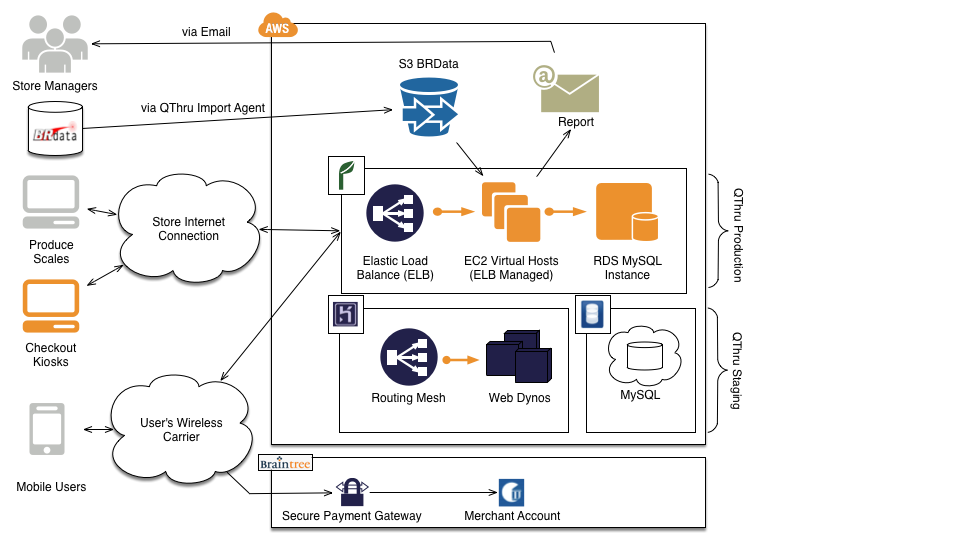
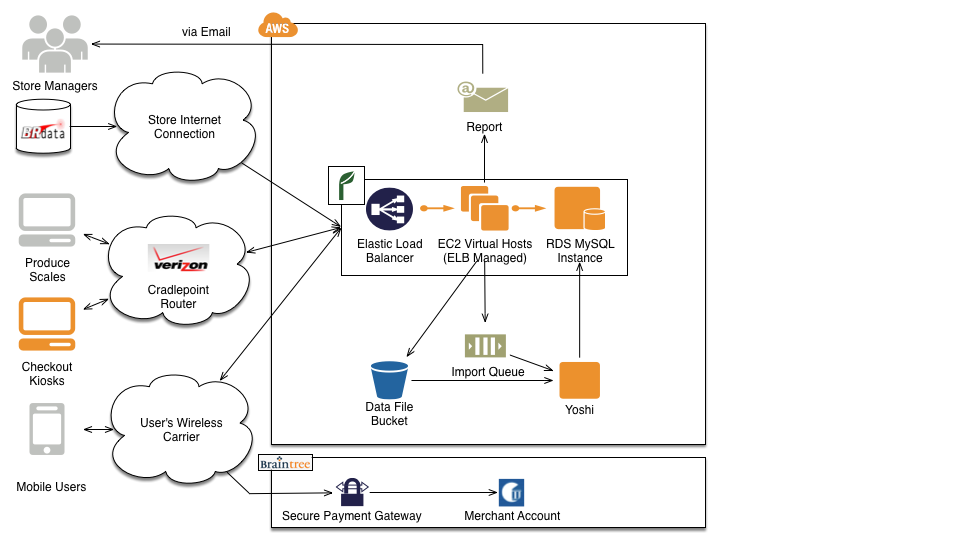
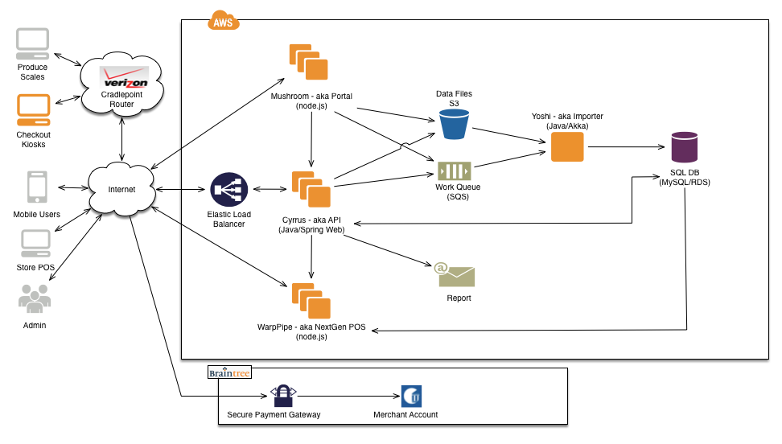

> Good judgment comes from experience, and experience comes from bad judgment.
>
> -- Frederick P. Brooks

Now that the NDAs have expired and QThru has officially folded, I think it's
important to publish what we learned from building a mobile commerce company
by a set of engineers that only had experience in the email and message space.
What we designed had some good parts but also some failures.

This is the third in a series of retrospective thoughts on QThru, a mobile
self checkout startup that went bust. See my
"[QThru Series](/2016/06/03/the-qthru-series.html)" post for a list of all the
topics.

Much of the architecture of QThru was created in an evolutionary manner over
the course of the 18 months that we were funded. When I started working at
QThru, a proof of concept Java webapp was already created and live. While functional,
the code suffered from a number of issues:

1. The database schema was managed entirely by hand. The DML scripts were not
kept in source control nor was there any way for a developer changing the schema
to make deployment to others automatic.

2. There were no unit tests. None. Not even around UPC parsing and validating,
which was some of the most straightforward code to test.

3. There were a number of environments setup in AWS that were costing the
company $100s every month. Without full time employees, there wasn't much
reason to run such a big infrastructure for testing all the time.

Within the first couple of months, I introduced [Flyway][9] library and schema
management into the app, started flushing out unit tests, setup a continuous
integration build and started an effort to migrate our test environments into
the free tier of [Heroku][2].

Our unit testing effort was 100% successful. [Jon Wang][10] focused on building
end to end tests against an embedded database while I focused on refactoring
and unit testing some of the untestable code in the app. Because of these efforts,
we never shipped a regression to production. We still had bugs but those bugs were
always due to a lack of understanding of the data being processed or some edge
case we assumed would never happen. Those were quickly addressed and tests were
created for them.

We did migrate our testing over to [Heroku][2] for a time but ultimately our use
of MySQL killed that effort. [Heroku][2] didn't support MySQL directly and the
third party provider had all sorts of odd behaviors and limits that we encountered.
Moving the database to PostgreSQL would set back our newly created end to end
testing and would have required undoing some bad SQL practices in our schema.

With the success of our automated testing, we eventually decided that we didn't
need a full time test environment. We tore it down and would recreate a new
environment on the rare occasions when we needed it. By this time, a new problem
came up - the inline data load process.

Left over from the POC code was a ReST request handler that spawned a Java
thread that would read through 100k+ data items and make numerous SQL requests
to check and update store inventory data. When this happened, the servlet's
connection pool would be entirely used by the data import and leave the API
unusable for a 20 minute period. We also started needing to make more frequent
changes to the load code to iterate on the data processing quicker. We needed
to split out the batch data processing from the online API. This resulted in
a process we called Yoshi that would import up all the data.

I came up with a naming scheme based on artifacts
from the Super Mario Bros universe. I was tired of the dry component names from
BlackBerry and wanted to interject a little fun. I discovered that cute names
can cause confusion for others. Yoshi eating the data made sense but it became
more difficult to find good names for other components.

The Yoshi data import process read short messages off a [SQS][4] message queue about
which data file to process. Since the files were larger in nature, we put them
into a [S3][5] bucket. This also provided us with the ability to archive every data
file we ever tried to import and was useful for debugging production issues. The
Yoshi process was a custom built data processing pipeline that used [Akka][1] and
the actor pattern to modularize the stages. The whole data import process could
be updated throughout the day without the need to worry about making the mobile
API unavailable.

Another sloppy decision from the POC code was how the data files were transferred.
Prior to the Yoshi change, a small program running in the back office computer
for each store would upload the to [S3][5]. This meant that we had our AWS keys
spread all over as well as being locked into a S3 bucket format. It wasn't a
huge problem with our 2 installs, but I knew we needed to change this sooner
rather than later. Instead of uploading directly to S3, we made a new HTTP
endpoint that could handle a file upload, store the files into S3 and then write
a [SQS][4] message to kick off the Yoshi import.

This second iteration of the architecture proved very successful. We had very
few problems with the Yoshi data import process and the durability provided by
[SQS][4] and [S3][5] made restarting a failed import painless. The use of
actors in Yoshi also made it easy to build out parallel pipelines, enabling us
to build future versions of the data import without impacting the old or
requiring a synchronized upgrade.

At this point we now started to understand the retail grocery business in more
detail and realized that tapping into the point of sale (POS) data file feeds
wouldn't scale. We discovered that a lot of small and medium sized retailers
change prices in the POS during the day. Others rely on the POS to calculate
rewards program savings or free offers. For these retailers, the POS is the system
of record and not the back office pricing systems. Our data import design worked
for a subset of customers but would not work with all of them.

In December of 2012, I made an off the cuff remark to Aaron Roberts while we
were sketching out alternative data import methods that it would be nice if we
could just text the POS and ask it for the current price. After some unrestrained
chatting and a quick proof of concept, we had designed a new component that would
communicate in real time with an individual POS terminal to assemble the cart
and run through the checkout process. Keeping with our naming scheme, we called
this new component "Warp Pipe" and wrote the whole system in 3 months in node.js.

David Clarke also joined the company around this time and started building out
a web portal for retailers to upload files or edit prices manually in the QThru
database. This gave us three methods for pricing integration - manually through
the web portal, automated with our batch data import API or real time with
Warp Pipe. The portal rounded out the platform and made it feel mature, hence
we nicknamed it Mushroom. Mushroom leveraged a lot of the backend APIs we had
for our mobile apps and as was a serverless app before that was a common buzzword.

Given the groundwork we laid with solid unit testing practices, the effort to
build out this third generation architecture was complete in 4-5 months. Even
though we used a new technology, node.js, with TDD we were able to have a high
level of confidence in the resulting code. When we shipped, we had 500ms real
time communication with the ISS45 POS working from the mobile device to a remote
POS terminal. Designing the Warp Pipe solution and managing its development is
the greatest accomplishment of my career. We only slipped our agreed upon date
by 2 weeks and delivered 95% of the functionality we promised, moving the HA
tasks to a follow up release.

It was at this time that Aaron informed us that we had burned through all our of
our cash in the bank and that our sole investor was not releasing additional
funding. The third version of our platform was also the final version that was
complete but never deployed to production long term. Two months later, QThru
would file for Chapter 7.

In the end, our architecture did have some flaws. The biggest oversight was
our lack of automated deployments. While TDD and our CI setup gave us confidence
that our code was correct, someone would still have to wait until the stores closed
at 11PM local time to take down the services and deploy a new version. This also
meant that there was a lot of room for human error. More than once a human mistake
caused an outage. Tooling in this area has gotten better and I would have spent
more time in this area if I was building out a system like this today.

We also had a huge single point of failure (SPOF) called MySQL. After a few
RDS outages and possible downtime due to a [hurricane][11], we started to talk
about replicating the database. I had explored  the idea of using [Riak][7] or
[Cassandra][8] to mitigate that SPOF but [Jon Wang][10] pushed back pretty hard
on these. He saw the database migration as problematic to both developers as
well as not being proven in production. Large scale outages never materialized
in our short run but a distributed solution is a must if the CEO is claiming
telcom grade uptime. In hindsight, I would have just built on one of those
databases from the beginning to avoid having to migrate the data later on.

Disclosure: I am currently employed by DataStax, a company that has a vested
interest in Cassandra.

At the time we were building the platform tools like [AWS Lambda][3] didn't
exist to let us trigger a process on queue message and then
shutdown the process. Instead, we had to deploy long running processes that
would remain idle for long periods of time and poll the [SQS][4] queue. [Akka][1] did
help take care of some of the threading overhead concerns but [AWS Lambda][3] would
have been simpler.

You may notice that we started to move towards a microservice architecture. In
the debate of [microservice vs. monolithic][6] service, both sides are correct. We
encountered a lot of pain because we had to deploy and monitor many processes
without good operational knowledge or automation. On the other hand, microservices
helped us isolate the risk in development and deployment where prior to the
shift, we had a lot of discussions about when we could deploy and what happens
if the data import process crashes. Neither is a silver bullet and is going to
consume engineering resources. The payoff for the effort on either side of the
debate is a service that is always on to your customers.

[1]: http://akka.io
[2]: http://heroku.com
[3]: https://aws.amazon.com/lambda/
[4]: https://aws.amazon.com/sqs/
[5]: https://aws.amazon.com/s3
[6]: https://www.infoq.com/news/2014/08/microservices-monoliths
[7]: http://basho.com/products/
[8]: http://cassandra.apache.org/
[9]: https://flywaydb.org/
[10]: http://jonwang.com/
[11]: https://en.wikipedia.org/wiki/Hurricane_Sandy
