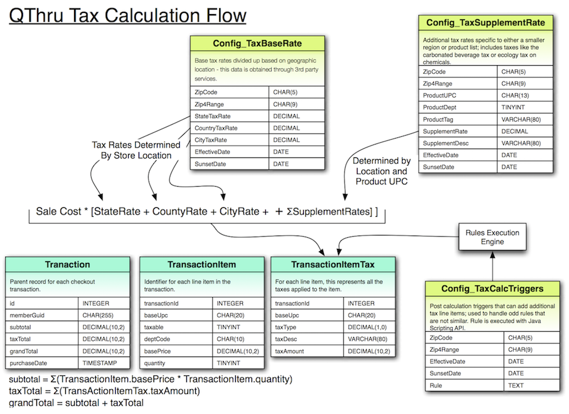

> "The hardest thing in the world to understand is the income tax."
>
> -- Albert Einstein

Consumers don't often think about the legal requirement that a [sales tax][sales-tax] 
must be paid by them for items they purchased based on where the transaction took place. 
Retailers with physical locations very often collect and submit that tax on behalf of the 
consumer to make the transaction easier. This means that any point of sale needs to have 
support built in to compute and add the sales tax on to the cart. 

This is the fifth in a series of retrospective thoughts on QThru, a mobile
self checkout startup that went bust. See my
"[QThru Series](/2016/06/03/the-qthru-series.html)" post for a list of all the
topics.

At QThru, we wanted to easy the setup process for business owners setting up their retail
operations on our platform. One key item we wanted to streamline was the sales tax rate
definitions. The difficult part with sales tax is the rates are often set down to zip codes
and may contain many tax holidays throughout the year. In order to speed up our development
efforts, we looked for a number of third party solutions. 
 
After a few months researching the problem, we settled on [ONESOURCE][ONESOURCE] from Thomason 
Reuters. This tax database is a simple text file that we could load into MySQL as necessary
and then use that information to compute the sales tax. The schema that we came up with for
the database was   

As we designed our tax rate calculations, it was obvious that some rules are just difficult
to model in data and require some form of code execution. At the time of design, we thought
that this could be written in JavaScript and executed through the Java Scripting API inside
our servlet container. Today I would lean towards writing the rules in Clojure and expose a
very limited set of functions instead of trying to deal with limiting the scope of what
JavaScript would be allowed to do.

After drafting this design and some prototyping, the business was never able to sign up a
new customer on the platform that was outside the Washington sales tax range that was hard
coded in the API. It would be interesting to know how this model would scale as we signed
up retail stores. 

[sales-tax]: https://en.wikipedia.org/wiki/Sales_tax
[ONESOURCE]: https://tax.thomsonreuters.com/products/brands/onesource/indirect-tax/rates/