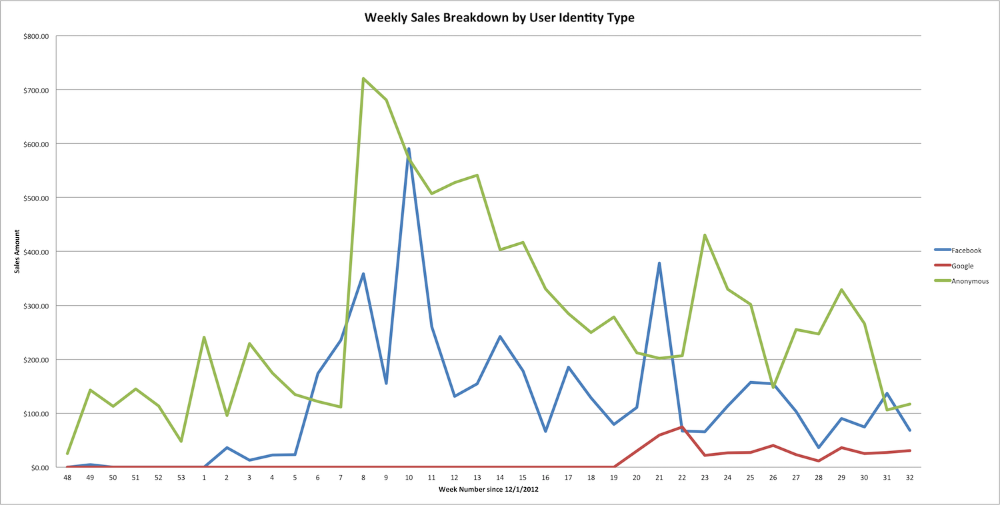
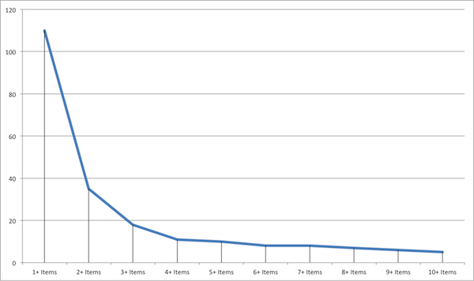

> “Our greatest weakness lies in giving up. The most certain way to succeed is always to try just one more time.”
>
> -- Thomas Edison

Shortly after Aaron informed everyone on July 8th, 2013 that QThru was out of money,
I met with one of my coworkers. We talked a lot about projects that were just left
unfinished and the potential we saw in the product. The most interesting question was
whether I would return to QThru if Aaron was removed and a new CEO was put in place.
In fact, a new CEO with experience selling into retail markets was just what QThru
needed as Aaron was unable to book any deals since we got funding. With that single 
answer, I started helping produce a plan to adjust course with QThru assuming that the
company could be taken over.   

This is the sixth in a series of retrospective thoughts on QThru, a mobile
self checkout startup that went bust. See my
"[QThru Series](/2016/06/03/the-qthru-series.html)" post for a list of all the
topics.

On a sunny July afternoon, I ended up meeting the individual who would take over as CEO
from Aaron. The goal was simple - produce a plan that could be executed on within 100 days
of Aaron's departure that would get the platform to a point where we would see traction
with retailers and shoppers. The engineering team would be fully funded for 160 days and
then we would revisit if the 100 day plan was successful enough to continue on with. It was
made clear that only 2-3 engineers, including myself, would be able to continue and that
we would be questioning everything about the platform, business model and deployment.

For the next 30 days, I met frequently with the new relaunch team on what needed to be
done. We started by looking at the year of transactions from shoppers and the behaviors
based on the profile data we had. 

First thing we noticed was the declining value of the carts. The two pops in the graph were
also the times that Aaron, Dawnie and Phil were at the store pushing people to sign up and
offering them a discount if they would make that trip with QThru. The promotions were not
sustaining usage though. The lack of promoting QThru in the final weeks also tied into a
skunkworks project that Aaron and David Clarke were pitching. It was clear that we needed
to push this solution and leaving it to users or the retailer was not working out.

We also decided to drop support for the various third party sign ons. The actual usages from
profiles with Google and Facebook mainly came from the development team. Given an anonymous
way to shop, people will not sign in with these platforms. We also never had a good tie in
other than reading all your profile information. 

Next we looked at how many items people kept in their Favorites list. A key tenant of QThru's
app was that people would mark these items so they could quickly checkout in the future.

 
As I had suggested, most users were adding a single item to their favorite list as prompted
by the app when launched for the first time. After that single addition, the usage drops off
considerably. We found after Digging further into the profiles with more than 2 items that those
usages represented the development team. This analysis was also done with favorite stores and
shopping lists with similar results. The relaunch team concluded that features of the product
that consumed a majority of the development capacity was not actually being used.

After reviewing some of the numbers, the new CEO started putting together a go to market
strategy that was succinct and based on the retail business environment. Unlike Aaron's plan
of people just adopting this to avoid lines, we had a plan of rolling out sustained promotions
and using existing partners to promote the application. This meant that we would be working
with a CPG to give better discounts through QThru, paid for by QThru, if they brought us in
to a sales meeting with retailers. He already had tons of connections that were VPs in CPG
companies and willing to explore that further.

I was put in charge of building a plan to simplify the platform. This was based around four
initiatives:

#### Simplify Checkout

Ditch the requirement that a retailer needs to purchase a kiosk, printer and stand from us
that must be installed in favor of a tablet/printer that is carried around on an employee
much like what you see at rental car companies. Data in the app for pictures and information
would come entirely from partners and the mobile application would be streamlined.

#### POS Integration

Drop support for the back office connectors and focus solely on the POS integration efforts
we had. Form partnerships with POS vendors to integrate our DLL library as a plugin to their
system instead of add on clients. Train and leverage VARs to install and setup new customers
with integrations.

#### Fix Profiles

The consumer profiles we had didn't really contain the right data for use with a CPG partner
or in mining behaviors of consumers. Focus on building out a solid schema of data to capture,
update the existing apps and dump incomplete profiles where it made sense.

#### Get Lean

Do more with less. Simplify the technical stack by adopting node.js for all backend components
and leverage MonoTouch for our new mobile applications. This pairs down the technologies used
to 2 languages and would allow us to target both Android and iOS.

New mobile app wireframe diagrams were also created. The new UI focused on scanning into a
shopping cart and checking out. It avoided neat UI tricks like sliding shopping lists and
focused on getting things done. A number of non-tech people were given paper mock ups to use
and almost universally people understood the new app flow more that the old. It wasn't going
to win any design awards but did get people through the process.

The relaunch team eventually met in August to review the Go To Market plan and the details on
how to rebuild the platform in 100 days leveraging what we had. After 5 hours of presentations
and discussions, the plan was approved. We would carry over two of the mobile developers, Mark
and Alven, to join me in the engineering team. After approving the budget for everything, we
celebrated with drinks and dinner.

The relaunch plan had only one weakness - Aaron would turn the company over to the courts
by filing Chapter 7. On September 30th, 2013 that's exactly what happened. Recreating everything
from scratch took the 100 day plan and made it a year plus. The investment that was lined up
wouldn't hold out and I lost my enthusiasm for retail. The relaunch team decided in January 2014
to disband and go their separate ways. 

## That's All Folks

My life was very much a roller coaster during the 18 months that I worked at QThru. I experienced
the excitement of going to work on something I was passionate about every day. I have fond memories
hiding out in the back corner of another startup, to celebrate funding and eventually seeing the 
messy end. It's something I'm glad that I was apart of and an experience I'm not sure I'll ever
replicate again.

One thing I didn't see at the time was how weak the leadership of the company was. Aaron did have
some interesting ideas how position QThru but suffered from the "not invented here" engineering
syndrome. He really dropped the ball when it came time to partner with the necessary players in
the market and push deployments. The other C-suite employees he picked also had the same shortcomings
as Aaron and didn't really round out our team.

And to think, we could have been Instacart.
